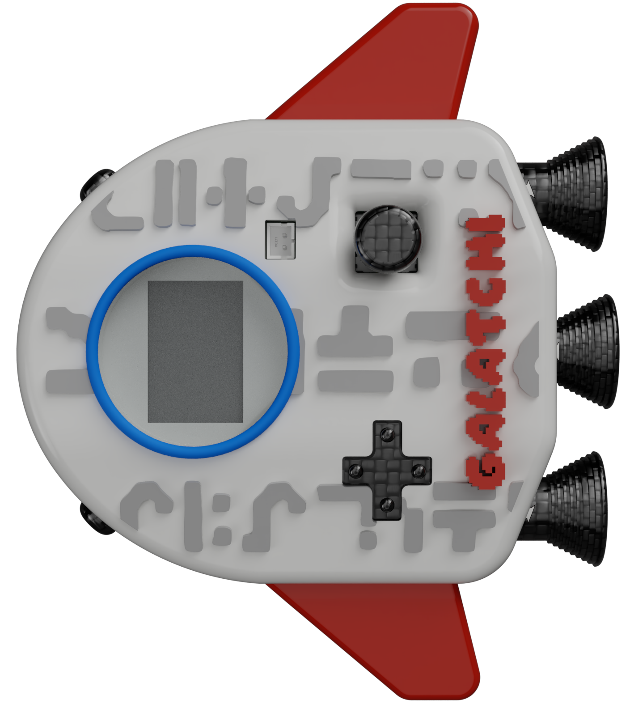
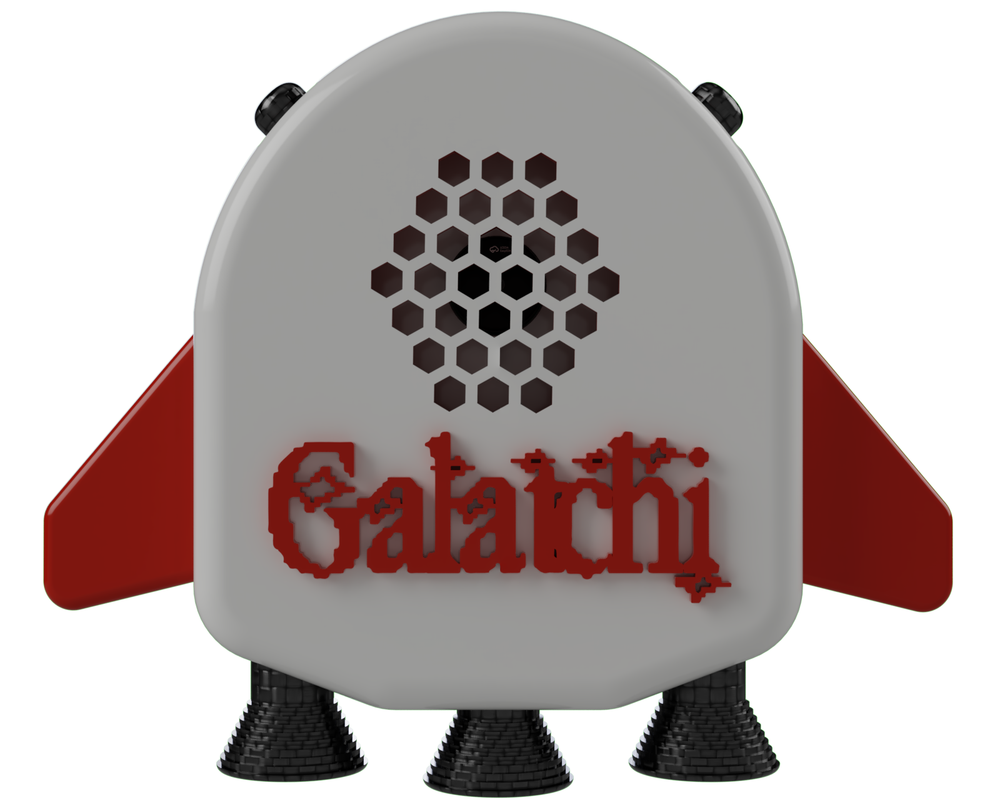
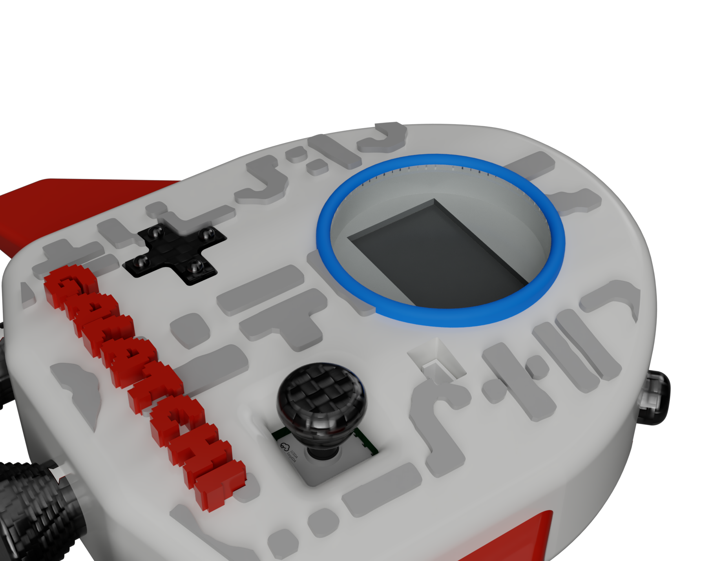
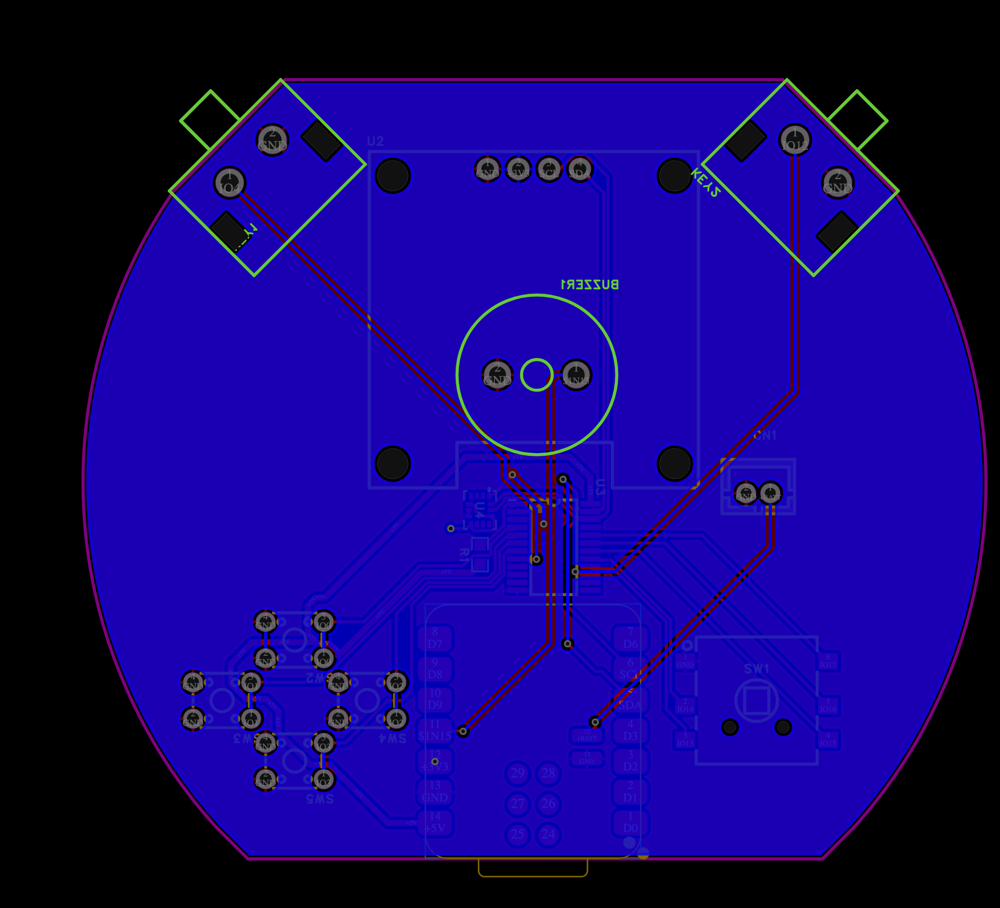
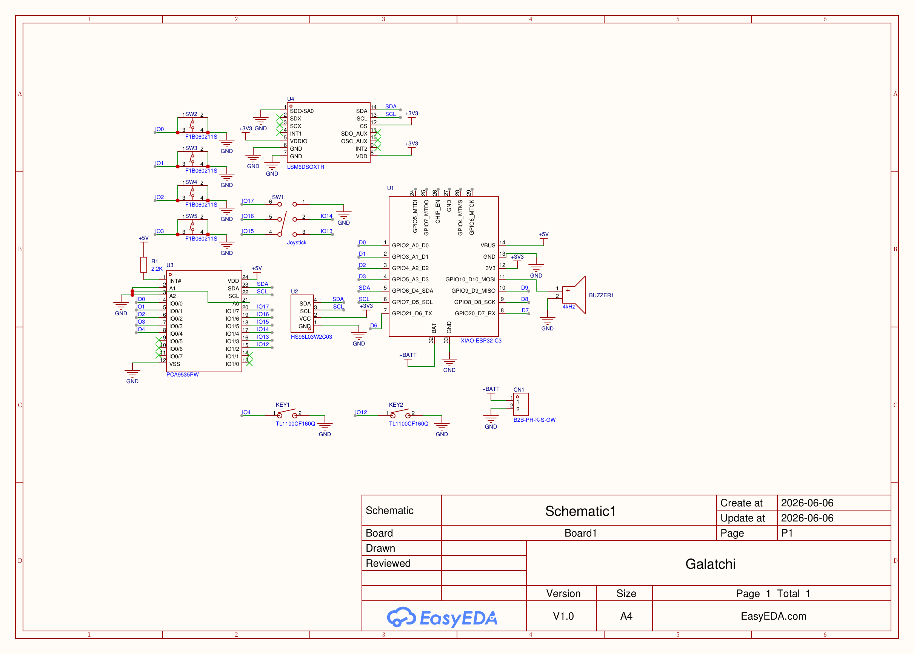

<div align="center">

#   <br><br> 

A Tamagotchi but from another planet    

<p>


</p>

### _Your care determines the alien you get._
</div>

---

# Overview

<div align="center">


</div>

**Galatchi** is an open-source virtual alien pet inspired by classis Tamagotchi devices, but with a twist.

Instead of raising the same pet every tim, your decisions shape the a mysteriuos extraterrestrial lifeform.

---

# Gallery

<div align="center">





</div>

---

# Motivation

Most virtual pets follow a predictable path.

Galatchi was designed around discovery.

The goal was somple:

> What if every play raised a completely different alien?

The project explores how small choices can create unique outcomes through ....  TBD after firmware

---

# Features 

TBD after firmware

---

# Gameplay

TBD after firmware

---

# Hardware Stack

|Parameter|Value|
|-----------|----------|
|MCU|Seeed XIAO ESP32-C3|
|Display |OLED Display|
|Motion Sensor|6-Axis IMU|
|Audio|Piezo Buzzer|
|Controls|5-Way Joystick + 4 Button Dpad|
|Battery|Rechargeable LiPo|
|Expansion|I/O Expander|
|Connectivity|UCB-C|
|PCB|Custom 2-Layer PCB|
|Firmware|Open Source|

---

# PCB Design

The board includes:
Seed XIAO ESP32-C3
OLED Display Interface
PCA9535 I/O Expander
LSM6DSOXTR 6-Axis IMU
Piezo Audio System
Battery Connector
UCB-C Programming Interface

---

# PCB



---

# Schematic



---

# Creatyre Evolution

TBD

# Build Guide

## 1. Order the  PCB
```bash
./PCB/GalatchiGerber.zip
```

## 2. Order Components

```bash
./PCB/GalatchiBOM.csv
```

## 3. Assemble the Hardware

Recommended tools:

Flux
Fine-tip Soldering Iron
Tweezers
Hot Air Station

## 4. Flash the Firmware

Connect the device using USB-C.

```bash
./Firmware/
```

## 5. Hatch Your Alien

Power on Galatchi.

Watch your egg hatch.

Begin exploring an entirely unknown spcies.

---

# Applications

Retro Gaming Enthusiasts
Open Source Harware Projects
STEM Education
Embedded Systems Learning
Interactive Electronics

---

# Repository Structure

```bash
Galatchi/
├── PCB/
├── CAD/
├── Firmware/
├── Assets/
├── Gallery/
├── Docs/
└──README.md
```

---

# Current Status

- [X] Concept Design
- [X] Schematic Design
- [X] PCB Design
- [ ] Final Build
- [ ] Community Testing

---

# Contributing

Contributions, suggestions, and feedback are welcome.

If you'd like to improve Galatchi

```bash
git clone 
cd Galatchi
```

1. Create a feature  branch
2. Make your changes
3. Commit your work
4. Open a pull request

---

# Creator

### Azmeer Pirani

Built with ❤️ for:
- Tiny Gadgets
- Alien Worlds
- Retro Electronics
- Open Source Hardware
- Pocket-Sized Adventures

---

# License

This project is licensed under the MIT License.

---

<div align="center">

# GALATCHI

### _Your care determines the alien you get._

</div>

