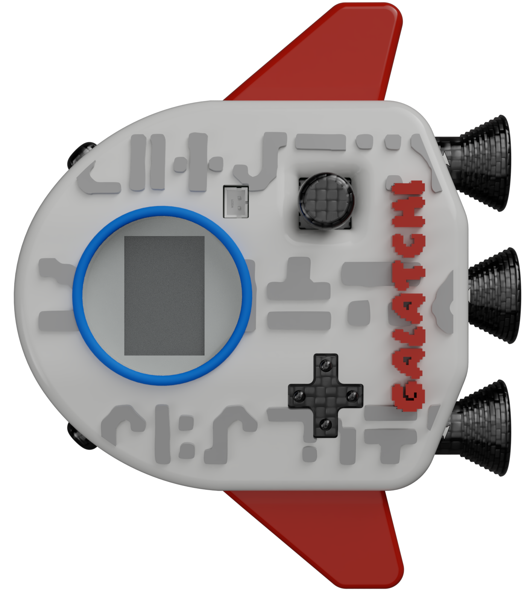
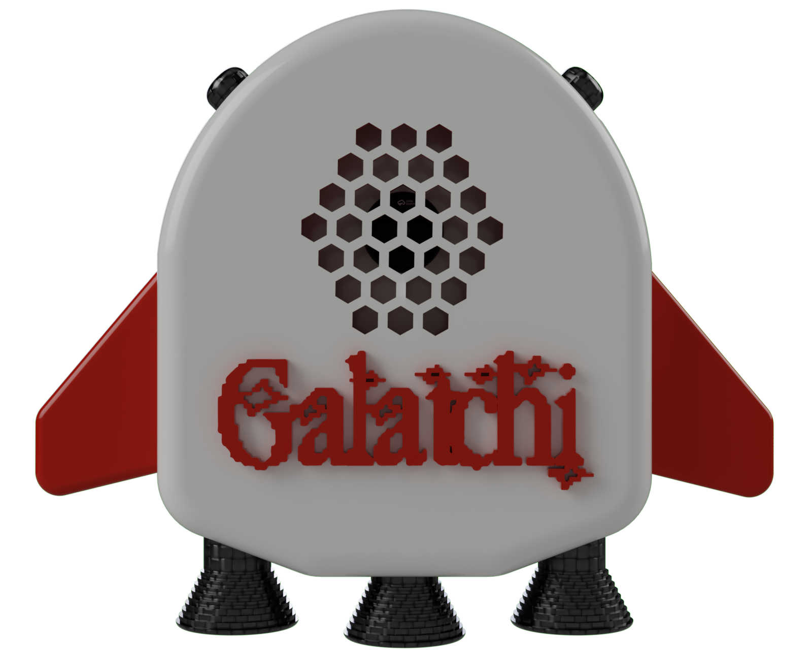
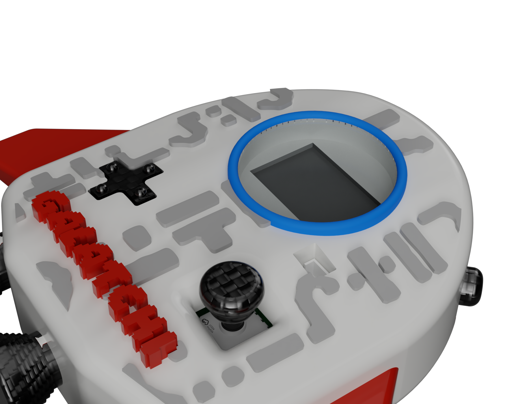
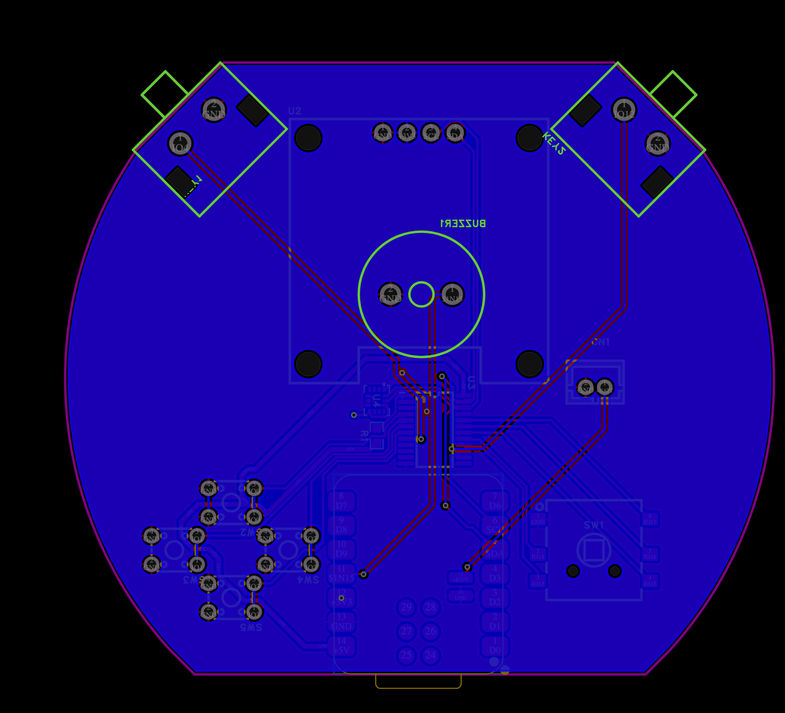
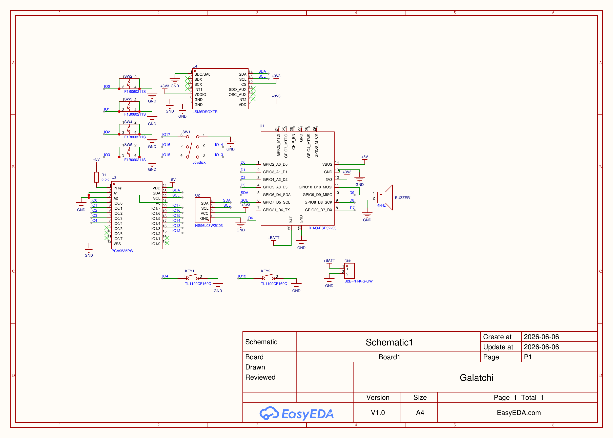

<div align="center">

#   <br><br> 

A Tamagotchi but from another planet    

<p>


</p>

### _Your care determines the alien you get._
</div>

---

# Overview

<div align="center">


</div>

**Galatchi** is an open-source virtual alien pet inspired by classis Tamagotchi devices, but with a twist.

Instead of raising the same pet every tim, your decisions shape the a mysteriuos extraterrestrial lifeform.

---

# Zine


---

# Gallery

<div align="center">





</div>

---

# Motivation

The Tamagotchi is a classis retro game played by not only kids but all ages time to time. 

Galatchi is trying to be something similar but instead of:

### _Your care determines the **PET** you get._

its

### _Your care determines the **ALIEN** you get._

The goal was simple:

> To make something nostalgic enough but so unique and related to an area no one ever though of.


---

# Features 

- XIAO ESP32-C3 Plateform
- 128x64 I2C OLED Display
- LSM6DSOXTR 6-Axis IMU
- PCA9535 GPIO Expander
- 5-Way Naavigation Joystick
- Dual Action Side Buttons ( like the ones in ps5 controller 🤓)
- Pizo Buzzer Audio
- LiPo Battery Powered
- USB-C Programming
- Open Source

---

# Gameplay

The exact gameplay is still under development, but some basic interaction are built and all peripherals are working. The OLED display provied animatino and status information, while the joystick and buttons are used for navigations and actions. The IMU enables motion-based interactions such as shaking titling and gesture detection. Audio feedback is provieded though the integrated buzzer.

Beyond this basic gameplay, I have planned to make it in such a way where a extraterestial creature's egg is found in the spaceship, and u have to control the spaceshpi with help of the IMU sensors, and other inputs.

---

# Hardware Stack

|Parameter|Value|
|-----------|----------|
|MCU|Seeed XIAO ESP32-C3|
|Display |OLED Display|
|Motion Sensor|6-Axis IMU|
|Audio|Piezo Buzzer|
|Controls|5-Way Joystick + 4 Button Dpad|
|Battery|Rechargeable LiPo|
|Expansion|I/O Expander|
|Connectivity|UCB-C|
|PCB|Custom 2-Layer PCB|
|Firmware|Open Source|

---

# BOM

|No.|Quantity|Comment      |Designator     |Footprint                                 |Value            |Manufacturer Part|Manufacturer|Supplier Part|Supplier|LCSC Price                                          |Link                                              |
|---|--------|-------------|---------------|------------------------------------------|-----------------|-----------------|------------|-------------|--------|----------------------------------------------------|--------------------------------------------------|
|1  |1       |4kHz         |BUZZER1        |BUZ-TH_BD12.5-P6.50-D1.4                  |4kHz             |1207-P6.5MM      |XHXDZ(兴华鑫)  |C49246964    |LCSC    |                                                    |https://www.lcsc.com/product-detail/C49246964.html|
|2  |1       |B2B-PH-K-S-GW|CN1            |CONN-TH_B2B-PH-K-S                        |                 |B2B-PH-K-S-GW    |JST         |C5251182     |LCSC    |                                                    |https://www.lcsc.com/product-detail/C5251182.html |
|3  |2       |TL1100CF160Q |KEY1 KEY2      |KEY-TH_TL1100CF160Q                       |                 |TL1100CF160Q     |E-Switch    |C273459      |LCSC    |                                                    |https://www.lcsc.com/product-detail/C273459.html  |
|4  |1       |2.2K         |R1             |R0603                                     |2.2K             |                 |            |             |        |12.0978                                             |                                                  |
|5  |1       |Joystick     |SW1            |SW-SMD-6P-L10.5-W10.0_C2858290            |                 |Joystick         |SHOU HAN(首韩)|C2858290     |LCSC    |                                                    |https://www.lcsc.com/product-detail/C2858290.html |
|6  |4       |F1B060211S   |SW2 SW3 SW4 SW5|SW-TH_4P-L4.5-W4.5-P3.00-LS4.8            |                 |F1B060211S       |SAMZO(三佐)   |C29780794    |LCSC    |                                                    |https://www.lcsc.com/product-detail/C29780794.html|
|7  |1       |XIAO-ESP32-C3|U1             |Seeed_Studio_XIAO_Series:XIAO-ESP32-C3-SMD|XIAO-ESP32-C3-SMD|                 |            |             |12.0978 ||https://www.seeedstudio.com/XIAO-ESP32C3-p-5431.html                                                  |
|8  |1       |HS96L03W2C03 |U2             |OLED-TH_L27.8-W27.2-P2.54_C9900033791     |                 |HS96L03W2C03     |HS(汉昇)      |C5248080     |LCSC    |                                                    |https://www.lcsc.com/product-detail/C5248080.html |
|9  |1       |PCA9535PW    |U3             |TSSOP-24_L7.8-W4.4-P0.65-LS6.4-BL         |                 |PCA9535PW        |NXP(恩智浦)    |C129517      |LCSC    |                                                    |https://www.lcsc.com/product-detail/C129517.html  |
|10 |1       |LSM6DSOXTR   |U4             |LGA-14L_L3.0-W2.5-P0.50-TL                |                 |LSM6DSOXTR       |ST(意法半导体)   |C481766      |LCSC    |                                                    |https://www.lcsc.com/product-detail/C481766.html  |

---

# PCB Design

The board includes:
Seed XIAO ESP32-C3
OLED Display Interface
PCA9535 I/O Expander
LSM6DSOXTR 6-Axis IMU
Piezo Audio System
Battery Connector
UCB-C Programming Interface

---

# PCB



---

# Schematic



---

# Build Guide

## 1. Order the  PCB
```bash
./PCB/GalatchiGerber.zip
```

## 2. Order Components

```bash
./PCB/GalatchiBOM.csv
```

## 3. Assemble the Hardware

Recommended tools:

- Flux
- Fine-tip Soldering Iron
- Tweezers
- Hot Air Station

## 4. Flash the Firmware

Connect the device using USB-C.

```bash
./Firmware/
```

## 5. Hatch Your Alien

Power on Galatchi.

Watch your egg hatch.

Begin exploring an entirely unknown spcies.

---

# Applications

Retro Gaming Enthusiasts
Open Source Harware Projects
STEM Education
Embedded Systems Learning
Interactive Electronics

---

# Repository Structure

```bash
Galatchi/
├── PCB/
├── CAD/
├── Firmware/
├── Assets/
├── Gallery/
├── Docs/
└──README.md
```

---

# Current Status

- [X] Concept Design
- [X] Schematic Design
- [X] PCB Design
- [ ] Final Build
- [ ] Community Testing

---

# Contributing

Contributions, suggestions, and feedback are welcome.

If you'd like to improve Galatchi

```bash
git clone 
cd Galatchi
```

1. Create a feature  branch
2. Make your changes
3. Commit your work
4. Open a pull request

---

# Creator

### Azmeer Pirani

Built with ❤️ for:
- Tiny Gadgets
- Alien Worlds
- Retro Electronics
- Open Source Hardware
- Pocket-Sized Adventures

---

# License

This project is licensed under the MIT License.

---

<div align="center">

# GALATCHI

### _Your care determines the alien you get._

</div>

